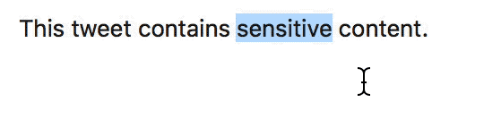

# DesenWords

### Download

[Here](https://github.com/cyyyu/DesenWords/releases)

### Usage

1. Select whatever you want to convert.
2. Cmd + Ctrl + b

### Known issues

* It doesn't work when using in most webpages because of webfonts.

### License

MIT
